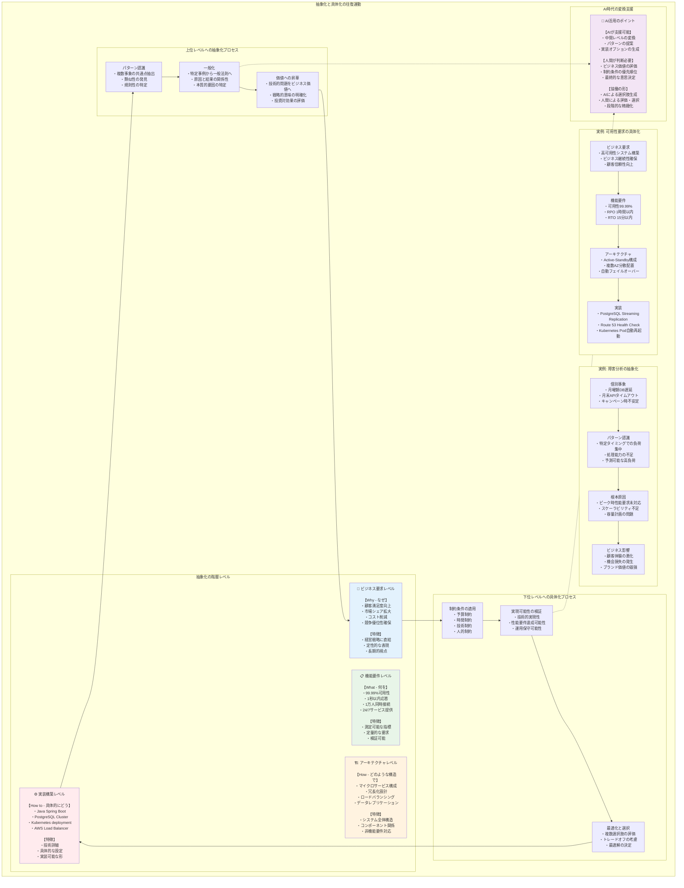
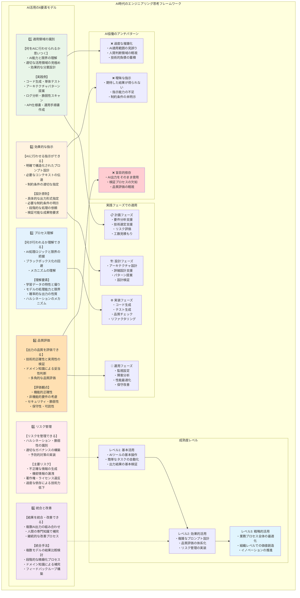

# 第1章：エンジニアの思考OS - 基本的な認知フレームワーク

優れたITエンジニアと平均的なエンジニアの差は、保有する知識量ではない。同じ問題に直面しても、異なるアプローチを取り、異なる結果を生み出す。その差を生むのは「思考のオペレーティングシステム」である。

本章では、エンジニアリングにおける基本的な思考パターンを体系化する。これらは、ソフトウェア開発、インフラ構築、データ基盤設計、セキュリティ対応など、あらゆるIT領域で共通して必要となる認知フレームワークである。

> **この章の学習目標**
> - 抽象化・具体化の4レベル（Why/What/How/How to）を使って、ビジネス要求から実装タスクまでを往復しながら整理できるようになること。
> - 多目的最適化や重み付けスコアの考え方を用いて、性能・保守性・コストなど複数の評価軸を構造化して比較できるようになること。
> - 技術的負債の定量化指標（Technical Debt Ratio など）を、「完璧な数値」ではなく、チームで議論するための共通言語として使うイメージを持つこと。
> 本章に出てくる数式や指標を暗記する必要はない。日々の設計やレビューの場面で、「どの観点でトレードオフを評価しているのか」を意識しながら使うためのツールとして読んでほしい。

## 本章とAI協働の標準手順（SOP）

本章は、[AI協働の標準手順（SOP）](../../introduction/ai-collaboration-sop/) のうち、主に次の工程に対応する。

- タスク定義（目的・制約・判断点を明確にする）
- 評価（トレードオフやリスクを可視化する）
- 反映（判断をADR等の成果物に落とす）

## 1.1 抽象化と具体化の往復運動

### なぜ抽象化と具体化が重要なのか

日々の業務で、我々は常に異なる抽象度のレベルを行き来している。経営層との会話では「システムの可用性を向上させたい」という抽象的な要求を受け取り、実装段階では「ロードバランサーの設定を変更する」という具体的な作業に落とし込む。この変換を適切に行えるかどうかが、プロジェクトの成否を左右する。

抽象化と具体化を自在に操ることで、以下が可能になる。
- ビジネス要求を技術的な解決策に変換できる
- 複雑な問題を管理可能な単位に分解できる
- 異なる立場のステークホルダーと効果的にコミュニケーションできる

### 抽象化レベルの階層モデル

エンジニアリングにおける抽象化には、以下の4つの基本レベルが存在する。

**1. ビジネス要求レベル（Why）**  
このレベルでは「なぜそれが必要か」を扱う。例えば「顧客満足度を向上させたい」「市場シェアを拡大したい」といった、ビジネス上の目的や価値を表現する。

**2. 機能要件レベル（What）**  
「何を実現するか」を定義する。「24時間365日サービスを提供する」「1秒以内にレスポンスを返す」など、システムが達成すべき具体的な機能や性能を記述する。

**3. アーキテクチャレベル（How）**  
「どのような構造で実現するか」を設計する。マイクロサービス構成、冗長化設計、データフローなど、システムの全体的な構造と主要コンポーネントを定義する。

**4. 実装/構築レベル（How to）**  
「具体的にどう作るか」を決定する。使用する言語、フレームワーク、ミドルウェア、具体的な設定値など、実際の構築作業に必要な詳細を扱う。

### レベル間の変換メカニズム



#### 上位レベルへの抽象化：パターン認識と一般化

具体的な事象から共通パターンを見出し、より上位の概念に昇華させるプロセスである。

**実例：障害対応からの学習**  
ある企業で、以下のような障害が発生したとする。
- 月曜朝にデータベースの応答が遅くなる
- 月末にAPIのタイムアウトが増加する
- キャンペーン開始時にシステムが不安定になる

これらの個別事象（実装レベル）から、「特定のタイミングで負荷が集中する」というパターン（アーキテクチャレベル）を認識し、さらに「ピーク時の性能要求を満たせていない」（機能要件レベル）、最終的に「ビジネスの機会損失が発生している」（ビジネス要求レベル）という上位の問題として抽象化できる。

#### 下位レベルへの具体化：制約条件の適用と最適化

抽象的な要求に対して、現実の制約を適用しながら実装可能な形に変換するプロセスである。

**実例：可用性要求の具体化**  
「高可用性システムを構築する」という要求（ビジネス要求レベル）を受けた場合の具体化プロセスは次のとおりである。

1. **機能要件への変換**
   - 可用性99.99%（年間ダウンタイム52.56分以内）
   - RPO（目標復旧時点）1時間以内
   - RTO（目標復旧時間）15分以内

2. **アーキテクチャへの変換**
   - アクティブ-スタンバイ構成のデータベース
   - 複数AZへの分散配置
   - 自動フェイルオーバー機構

3. **実装への変換**
   - PostgreSQLのストリーミングレプリケーション
   - AWS Route 53によるヘルスチェック
   - Kubernetes上でのPod自動再起動設定

### AI時代における抽象化と具体化

生成AIの登場により、抽象化と具体化のプロセスは新たな次元を獲得した。AIは中間レベルの変換を支援できる。一方で、最上位（ビジネス価値）の判断と、最下位（実装の詳細）における品質・安全性の最終責任は、依然として人間が担う領域である。

**AIを活用した変換の例**  
ビジネス要求「ECサイトの売上を向上させたい」に対して、AIに以下のような指示を与えることができる。

```text
ECサイトの売上向上という目標に対して、技術的な観点から実現可能な施策を、
機能要件レベルで5つ提案してください。各施策について、想定される効果と
実装の難易度も含めて説明してください。
```

AIは過去のパターンから、「レコメンデーション機能の追加」「サイト表示速度の改善」「検索機能の強化」などを提案できる。しかし、自社の技術力、予算、市場特性を考慮した最終判断は人間が行う必要がある。

## 1.2 トレードオフの定量化手法

エンジニアリングは常にトレードオフの連続である。完璧な解決策は存在せず、複数の相反する要求の中で最適解を見つける必要がある。このセクションでは、感覚的な判断を定量的な分析に置き換える手法を提供する。

### 多目的最適化の基本理論

#### パレート最適の概念

パレート最適とは、「一つの目標を改善するために、他の目標を犠牲にしなければならない状態」を指す。エンジニアリングにおけるトレードオフの多くは、このパレート最適の関係にある。

**例：データベース設計におけるトレードオフ**
- 高速読み込み vs データ整合性
- ストレージ効率 vs クエリ性能  
- 可用性 vs データの一貫性（CAP定理）

#### 重み付け法による単一目的化

複数の目標を単一の評価指標に統合することで、定量的な比較を可能にする手法。

**重み付けスコア計算式**
```text
総合スコア = Σ(重み × 正規化された評価値)
```

### エンジニアリングにおける典型的トレードオフ

#### 性能 vs 保守性

高性能を追求すると、しばしばコードの複雑性が増し、保守性が低下する。

**実例：キャッシュ戦略の選択**
- **選択肢A**：単純なメモリキャッシュ
  - 性能：中（レスポンス時間200ms）
  - 保守性：高（実装・運用が簡単）
  - 拡張性：低（単一サーバー限定）

- **選択肢B**：分散キャッシュ（Redis Cluster）
  - 性能：高（レスポンス時間50ms）
  - 保守性：中（設定・監視が複雑）
  - 拡張性：高（水平スケール可能）

#### 開発速度 vs 品質

短期的な開発速度を優先すると、長期的な品質に影響を与える可能性がある。

**技術的負債の概念**  
将来のメンテナンス性を犠牲にして、短期的な開発速度を得る選択。この「負債」は利息を伴って返済が必要になる。

### 意思決定マトリクスの構築

#### 評価軸の選定方法

1. **ステークホルダー分析**：誰にとって重要な指標かを特定
2. **制約条件の整理**：譲れない条件と妥協可能な条件を分離
3. **測定可能性の確認**：定量的に評価できる指標を優先

#### スコアリング手法

**5段階評価による例**

| 評価軸 | 重み | 選択肢A | 選択肢B | 選択肢C |
|--------|------|---------|---------|---------|
| 性能 | 0.4 | 3 | 5 | 2 |
| 保守性 | 0.3 | 5 | 3 | 4 |
| コスト | 0.2 | 4 | 2 | 5 |
| 実装期間 | 0.1 | 2 | 4 | 5 |
| **総合スコア** | - | **3.7** | **3.7** | **3.5** |

#### 感度分析の実施

重みの変更が結果に与える影響を分析し、判断の頑健性を確認する。

**例：性能の重みを0.4→0.6に変更した場合**
- 選択肢A：3.5
- 選択肢B：4.1（最優先に変化）
- 選択肢C：3.1

## 1.3 技術的負債の経済学的評価

### 技術的負債の分類

技術的負債は、将来の開発・保守コストに影響を与える設計・実装上の選択である。適切に管理すれば価値を生むが、放置すれば組織の技術力を蝕む。

#### 意図的負債 vs 非意図的負債

**意図的負債**：戦略的に選択された負債
- 市場投入のスピードを重視
- リソース制約による妥協
- 学習コストの先送り

**非意図的負債**：知識不足や見落としによる負債
- 設計の誤り
- 技術選択のミス
- テストの不足

#### 短期負債 vs 長期負債

**短期負債**：近い将来に返済予定の負債
- リファクタリング予定のコード
- 一時的な回避策
- プロトタイプ品質のコード

**長期負債**：継続的に利息を支払う負債
- レガシーシステム
- 古い技術スタック
- 設計の根本的な問題

### 負債の定量化モデル

#### 将来の修正コストの現在価値計算

```text
現在価値 = 将来コスト / (1 + 割引率)^年数
```

**例：レガシーAPI保守の負債計算**
- 年間保守コスト：500万円
- 予想継続年数：5年
- 割引率：10%
- 現在価値：約1,895万円

#### リスク調整後リターンの評価

技術的負債には不確実性が伴うため、リスクを考慮した評価が必要。

```text
期待値 = Σ(発生確率 × 影響度)
```

### 返済戦略の立案

#### 優先順位付けフレームワーク

1. **ビジネス影響度**：売上・顧客満足度への影響
2. **技術的影響度**：開発生産性・品質への影響
3. **返済容易性**：必要な工数・リスク
4. **緊急度**：放置した場合の悪化速度

#### リファクタリングROIの算出

```text
ROI = (削減される年間コスト × 残存年数 - 返済コスト) / 返済コスト
```

## 1.4 AI時代のエンジニアリング思考フレームワーク

### AI活用の6要素モデル

AI時代のエンジニアには、AIツールを効果的に活用しながら高度な判断を行う能力が求められる。この能力を6つの要素に分解して体系化する。



#### 1. 適用領域の識別

**何をAIに行わせられるか思いつく**

AIの能力と限界を理解し、適切な活用領域を見極める能力。

**実践例**：
- コード生成：定型的な処理、単体テスト、設定ファイル
- 設計支援：アーキテクチャパターンの提案、命名の提案
- 分析支援：ログ分析、コードレビュー、脆弱性スキャン
- ドキュメント：API仕様書、運用手順書の作成

#### 2. 効果的な指示

**AIに行わせる指示ができる**

明確で構造化されたプロンプトを設計し、必要なコンテキストと制約条件を適切に伝達する能力。

**プロンプト設計の原則**：
- 具体的な出力形式の指定
- 必要な制約条件の明示
- 段階的な処理の依頼
- 検証可能な成果物の要求

#### 3. プロセス理解

**何が行われるか理解できる**

AIの処理ロジックと限界を把握し、ブラックボックス化を避ける能力。

**理解すべき要素**：
- 学習データの特性と偏り
- モデルの処理能力と限界
- 確率的な出力の性質
- ハルシネーションのメカニズム

#### 4. 品質評価

**出力の品質を評価できる**

技術的正確性と実用性を検証し、ドメイン知識に基づく妥当性判断を行う能力。

**評価観点**：
- 機能的正確性
- 非機能的要件の考慮
- セキュリティ・脆弱性
- 保守性・可読性

#### 5. リスク管理

**リスクを管理できる**

ハルシネーション、セキュリティ脆弱性を識別し、適切なガバナンスを構築する能力。

**主要リスク**：
- 不正確な情報の生成
- 機密情報の漏洩
- 著作権・ライセンス違反
- 過度な依存による技術力低下

#### 6. 統合と改善

**結果を統合・改善できる**

複数のAI出力を組み合わせ、人間の専門知識で補完し、継続的に改善する能力。

**統合手法**：
- 複数モデルの結果の比較検討
- 段階的な精緻化プロセス
- 人間のドメイン知識による補完
- フィードバックループの構築

### 各要素の実践的適用

#### 日常業務での活用パターン

**設計フェーズ**：
1. 適用領域：アーキテクチャパターンの調査
2. 効果的な指示：要件を構造化して設計案を依頼
3. プロセス理解：提案の根拠と前提条件を確認
4. 品質評価：非機能要件との整合性を検証
5. リスク管理：設計の盲点を別途検証
6. 統合と改善：複数案を統合して最適化

**実装フェーズ**：
1. 適用領域：コード生成、テスト生成
2. 効果的な指示：仕様を明確に伝達
3. プロセス理解：生成ロジックの妥当性確認
4. 品質評価：コードレビューと動作検証
5. リスク管理：セキュリティチェック
6. 統合と改善：既存コードとの統合とリファクタリング

#### 失敗事例から学ぶアンチパターン

**アンチパターン1：盲目的な依存**
- 現象：AIの出力をそのまま使用
- 問題：品質評価とリスク管理の欠如
- 対策：必ず人間による検証プロセスを挟む

**アンチパターン2：曖昧な指示**
- 現象：期待した結果が得られない
- 問題：効果的な指示の能力不足
- 対策：具体的な制約と出力形式を明示

**アンチパターン3：過度な複雑化**
- 現象：AIでできることを無理に実現しようとする
- 問題：適用領域の識別ミス
- 対策：人間が行うべき判断との境界を明確化

### AI時代の思考の進化

#### 実装から設計へのシフト

AIが実装の詳細を支援することで、エンジニアはより上位の設計に集中できるようになる。

**従来**：「どうコードを書くか」に時間を費やす
**AI時代**：「何を実現するか」「なぜそれが必要か」により多くの時間を投入

#### 詳細から全体最適へのシフト

個別の最適化から、システム全体の価値最大化への思考の転換。

**従来**：局所的な効率化を重視
**AI時代**：ビジネス価値と技術的制約の総合的なバランスを重視

#### 個別最適から統合へのシフト

単一技術の習得から、複数技術・ツール・AIの組み合わせによる価値創造へ。

**従来**：特定技術の専門性を深める
**AI時代**：多様なツールを統合して価値を生み出す能力を重視

## まとめ

本章では、AI時代のエンジニアリングの基礎となる思考フレームワークを提示した。抽象化と具体化の往復運動、トレードオフの定量化、技術的負債の経済学的評価、そしてAI活用の6要素モデルは、いずれも現代のエンジニアに不可欠な能力である。

これらの思考ツールは、技術領域を問わず適用できる普遍的なフレームワークである。ソフトウェア開発、インフラ構築、データエンジニアリング、セキュリティ対応など、あらゆる場面で威力を発揮する。

次章では、これらの基礎能力を要件定義の場面でどう活用するかを詳しく見ていく。曖昧な要求を具体的な仕様に変換する過程で、どのような思考プロセスが必要になるのかを探求する。

次に読む： [第2章：要件定義の認知プロセス](../chapter-02/) / [目次（トップ）](../../)

---

## この章のまとめとチェックリスト

### この章のまとめ

- 抽象化と具体化の往復運動、トレードオフの定量化、技術的負債の経済学的評価など、AI時代のエンジニアに共通して求められる思考フレームワークを整理した。
- 生成AIを含む各種ツールを前提に、「AI に任せる部分」と「人間が判断すべき部分」を切り分けるための土台となる認知フレームを提示した。
- これらの思考ツールが、後続の要件定義・アーキテクチャ設計・開発・危機対応といった各章の具体的な場面に横断的に適用されることを位置づけた。

### この章を読み終えたら確認したいこと

- [ ] 自分が関わっているプロジェクトに対して、「Why/What/How/How to」の4レベルで整理した簡易マップを描いてみたか。
- [ ] 最近の技術的判断や設計判断を 1 つ選び、どのようなトレードオフを意識していたか（あるいはしていなかったか）を振り返ることができるか。
- [ ] 技術的負債について、感覚的な「負債が多い／少ない」ではなく、何らかの指標や経済的観点で表現するイメージを持てているか。

### 関連する付録・テンプレート

- 本章で紹介した思考ツールを実務で使う際は、[付録A：思考ツールテンプレート集](../../appendices/templates.md) に掲載されている各種テンプレートを参考にしてほしい。
- 実際のプロジェクトでの適用例については、[付録B：ケーススタディ](../../appendices/case-studies.md) の中で、本章のフレームワークがどのように使われているかを参照すると理解が深まる。
- 汎用スキル（問題設定/構造化/検証）の補完関係は、[前作（論理思考ガイド）との接続](../../introduction/bridge-logical-thinking-guide/) を参照してほしい。
