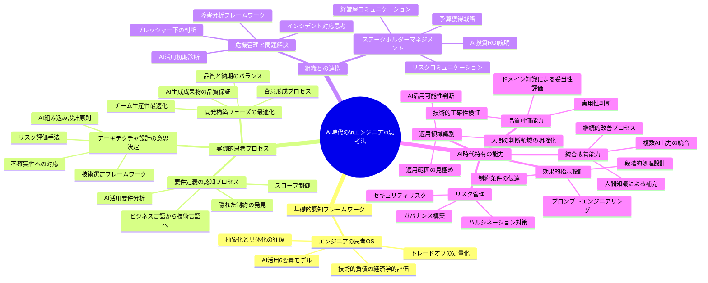
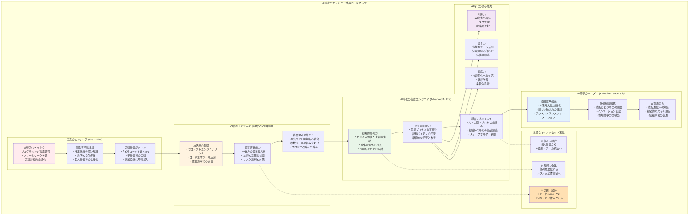

# まえがき

## AI時代における「思考法」の意義

2024年、生成AIはITエンジニアの日常的なツールとなった。コード生成、設計支援、ドキュメント作成、デバッグ支援。かつて何時間もかかった作業が、適切なプロンプトで数分に短縮される。この革命的な変化の中で、エンジニアの役割は根本的に問い直されている。

しかし、優秀なITエンジニアと平均的なエンジニアの差は、AIの登場によってむしろ拡大している。同じAIツールを使いながら、生み出す成果には大きな差がある。その差を生むのは、依然として「思考のプロセス」である。

AIが「どのように」実装するかを支援する今、エンジニアには「何を」「なぜ」作るのかという、より本質的な判断が求められる。AIの出力を評価し、修正し、統合する能力。複雑な問題を適切に分解し、AIに委ねる部分と人間が判断すべき部分を見極める能力。これらは、AIには代替できない人間の領域である。

本書は、AI時代のプロフェッショナルなITエンジニアが持つべき思考プロセスを可視化し、体系化したものである。AIツールを最大限活用しながら、人間にしかできない高度な判断を行うための「メタ認知」の手引書である。

## 本書の前提

現代のITエンジニアに求められる能力は、純粋な技術力だけではない。AIツールの適切な活用、ビジネス価値の理解、ステークホルダーとの調整、不確実性への対処、チームの生産性向上など、多面的な判断が要求される。

特に生成AIの普及により、以下の能力がより重要になっている：
- AIの出力を批判的に評価し、適切に修正する能力
- 複雑な問題を、AIが処理可能な形に分解する能力
- AIでは判断できない文脈や制約を総合的に評価する能力
- AIを活用したチーム開発を効果的にマネジメントする能力

しかし、これらの判断プロセスは属人的なノウハウとして扱われ、体系的に学ぶ機会は少ない。本書は、こうした暗黙知を明文化し、AI時代に即した形で再現可能な形で提供することを目的としている。

## 想定読者

本書は以下のような読者を想定している：

- 技術的には一定の経験を積んだが、より上位の判断を求められるようになったエンジニア
- テックリードやアーキテクトとして、技術選定や設計判断の責任を負う立場の人
- エンジニアリングマネージャーとして、チームの生産性と成果に責任を持つ人
- 経営層とエンジニアリング現場の間で、橋渡し役を担う人

## 本書のアプローチ

本書で扱う思考法は、特定の技術領域に依存しない。ソフトウェア開発、インフラ構築、データ基盤設計、セキュリティ対応、SRE/DevOps、プラットフォームエンジニアリングなど、技術的な専門性は異なれど、優れたエンジニアが持つ思考プロセスには共通性がある。

要件を分析し、アーキテクチャを設計し、トレードオフを評価し、ステークホルダーと調整し、インシデントに対応する。これらの活動における判断の質が、エンジニアとしての成果を左右する。本書は、こうした判断の背後にある思考プロセスに焦点を当てることで、あらゆる技術領域で活用可能な内容を目指した。

生成AIの活用においても同様である。コード生成、インフラ設定の自動化、セキュリティ脆弱性の検出など、適用場面は異なっても、AIの出力を評価し、統合する思考プロセスは共通している。

本書では、AI活用に必要な6つの中核能力（適用領域の識別、効果的な指示、プロセス理解、品質評価、リスク管理、統合と改善）を基本フレームワークとして採用し、各章でその具体的な適用方法を示していく。これにより、読者はAIツールを単に使うだけでなく、AIと協働しながら高度な判断を行うための体系的な思考法を身につけることができる。

## 本書の構成と読み方

> **この本の読み方の目安**
> - 現在テックリードやアーキテクトとして意思決定を担っている読者は、第1章と第3章・第6章を軸に読み進め、必要に応じて第2章・第4章・第5章で具体的なプロセスやステークホルダーマネジメントを補完するとよい。
> - キャリア初期〜中盤のエンジニアが「上位レイヤの思考」を俯瞰したい場合は、第1章を入口として、第2章・第4章の要件定義・開発フェーズの章から読み、興味や必要性に応じて第3章・第5章・第6章を参照する読み方も有効である。
> - 経営層やビジネスサイドとの橋渡し役を担う読者は、第5章と第6章を先に読み、必要に応じて前後の章で技術的背景を確認する、という読み順も選択できる。
> すべての章を順番どおりに読む必要はなく、自身の役割と現在直面している課題に応じて優先度を付けて構わない。

本書は6つの章から構成される。各章は独立して読むことも可能だが、全体として以下のような思考の流れを形成している。各章には「AI活用の視点」を組み込み、現代的な開発環境での実践を意識した構成となっている。

**第1章「エンジニアの思考OS」**は、本書全体の基礎となる認知フレームワークを提供する。抽象化と具体化の往復、トレードオフの定量化、技術的負債の評価に加え、AI活用における認知の罠と対策を扱う。

**第2章「要件定義の認知プロセス」**では、曖昧な要求を具体的な仕様に変換する過程を扱う。ビジネス側の言語を技術側の言語に翻訳し、隠れた制約を発見し、スコープを制御する手法とともに、生成AIを活用した要件分析の高度化を提示する。

**第3章「アーキテクチャ設計の意思決定」**は、長期的な視点での判断を扱う。不確実な未来に対する設計判断、技術選定、リスク評価に加え、AI組み込み型システムの設計原則を論じる。

**第4章「開発/構築フェーズの最適化思考」**では、日々の開発活動における判断を扱う。レビュープロセスでの合意形成、品質と納期のバランス、チーム生産性の最適化とともに、AI生成成果物の品質保証手法に焦点を当てる。

**第5章「ステークホルダーマネジメント」**は、技術とビジネスの接点における思考法を扱う。経営層への説明、予算獲得、リスクコミュニケーションに加え、AI投資のROI説明など、AI時代特有のコミュニケーション課題を扱う。

**第6章「危機管理と問題解決」**では、インシデント対応や障害分析など、プレッシャー下での判断を扱う。AIを活用した初期診断と、人間の高度な判断の統合方法を論じる。

## 本書の活用方法

本書は以下のような使い方を想定している：

1. **通読による体系的理解**: まず全体を通読し、プロフェッショナルエンジニアの思考体系の全体像を把握する

2. **リファレンスとしての活用**: 特定の状況に直面した際に、該当する章やフレームワークを参照する

3. **チーム学習の教材**: チーム内で共通の思考フレームワークを確立するための議論の土台として活用する

4. **実践とフィードバック**: 付録のテンプレートやケーススタディを使い、実際のプロジェクトで適用し、経験を蓄積する

## 最後に

エンジニアリングは創造的な知的活動である。生成AIの登場により、その創造性はより高い次元へとシフトしている。コードを書くことから、システムを設計すること、問題を定義することへ。実装の詳細から、ビジネス価値の創出へ。

本書が提供するフレームワークは、思考を制約するものではなく、AIツールと協働しながら、より高度な判断を可能にする土台である。AIは強力な道具だが、それを使いこなすのは人間の思考力である。

技術は日々進化し、AIの能力も急速に向上している。しかし、その技術を選び、組み合わせ、問題を解決する「思考のプロセス」は、より普遍的な価値を持つ。むしろAI時代だからこそ、人間の判断力、創造性、責任感がより重要になる。

本書が、読者のエンジニアリング人生において、AI時代を生き抜く思考の羅針盤となることを願っている。

2024年12月  
著者
